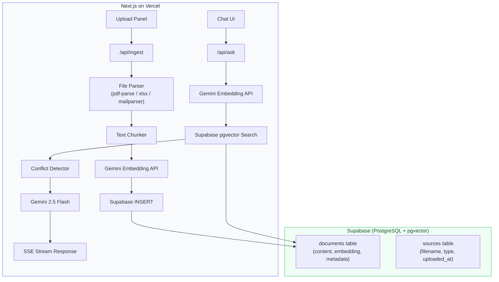

# VectorVault — Implementation Plan

> **AI Knowledge Retrieval Agent for SME Operations**
> Single-codebase Next.js app, deployable on Vercel in one click

---

## Overview

VectorVault is a knowledge retrieval platform that lets SME employees ask natural-language questions and receive accurate, source-cited answers synthesized from internal documents — PDFs, Excel spreadsheets, and email threads. The system automatically detects conflicting information across sources and resolves it using timestamp recency, source reliability, and specificity rules.

---

## Tech Stack (Vercel-Deployable)

| Layer | Technology | Why |
|:------|:-----------|:----|
| **Framework** | **Next.js 14** (App Router) | Single codebase for UI + API routes, native Vercel deployment |
| **Styling** | **Vanilla CSS** (clean light premium theme) | Full control, modern aesthetics, no build overhead |
| **Vector DB** | **Supabase** (PostgreSQL + pgvector) | Free tier, managed, cloud-native, metadata filtering via SQL |
| **Embeddings** | **Google `gemini-embedding-001`** | 768-3072 dims, free tier, same API key as LLM |
| **LLM** | **Gemini 2.5 Flash** (`gemini-2.5-flash`) | Latest stable — best price-performance, 1M context, thinking + structured output |
| **PDF Parsing** | **`pdf-parse`** | Pure JS, works in serverless, no native deps |
| **Excel Parsing** | **SheetJS (`xlsx`)** | Industry standard, in-memory buffer parsing |
| **Email Parsing** | **`mailparser`** | Full `.eml` parsing with `simpleParser` |

> [!TIP]
> **Single API key, single codebase, single deployment.** The entire app deploys to Vercel with `vercel deploy`. Supabase provides the vector DB (free tier: 500MB). Google AI provides both LLM and embeddings with one key.

---

## Architecture



### Data Flow

1. **Ingest** → User uploads PDF/Excel/Email → Next.js API route parses file in-memory → Chunks text → Calls Gemini Embedding API → Stores vectors + metadata in Supabase pgvector
2. **Query** → User asks question → API route embeds query → Supabase cosine similarity search → Returns top-K chunks → Conflict detection → Gemini 2.5 Flash generates structured answer → SSE stream to frontend

---

## Database Schema (Supabase)

```sql
-- Enable pgvector
create extension if not exists vector with schema extensions;

-- Sources table: tracks uploaded documents
create table sources (
  id uuid primary key default gen_random_uuid(),
  filename text not null,
  source_type text not null check (source_type in ('pdf', 'excel', 'email')),
  file_size integer,
  uploaded_at timestamptz default now(),
  metadata jsonb default '{}'
);

-- Documents table: stores chunks with embeddings
create table documents (
  id bigint primary key generated always as identity,
  source_id uuid references sources(id) on delete cascade,
  content text not null,
  embedding vector(768),  -- gemini-embedding-001 at 768 dims
  metadata jsonb not null default '{}',
  -- metadata includes: { section, page, row, sheet, subject, sender, date }
  created_at timestamptz default now()
);

-- HNSW index for fast cosine similarity search
create index on documents using hnsw (embedding vector_cosine_ops);

-- RPC function for similarity search
create or replace function match_documents(
  query_embedding vector(768),
  match_threshold float default 0.5,
  match_count int default 10
)
returns table (
  id bigint,
  content text,
  metadata jsonb,
  source_id uuid,
  similarity float
)
language sql stable
as $$
  select
    documents.id,
    documents.content,
    documents.metadata,
    documents.source_id,
    1 - (documents.embedding <=> query_embedding) as similarity
  from documents
  where 1 - (documents.embedding <=> query_embedding) > match_threshold
  order by documents.embedding <=> query_embedding
  limit match_count;
$$;
```

---

## Directory Structure

```
vectorvault/
├── src/
│   ├── app/
│   │   ├── layout.js              # Root layout + fonts
│   │   ├── page.js                # Main chat interface
│   │   ├── globals.css            # Design system
│   │   └── api/
│   │       ├── ask/route.js       # Query → embed → search → LLM → stream
│   │       ├── ingest/route.js    # Upload → parse → chunk → embed → store
│   │       └── sources/route.js   # GET list / DELETE source
│   ├── components/
│   │   ├── ChatInterface.jsx
│   │   ├── MessageBubble.jsx
│   │   ├── SourceCard.jsx
│   │   ├── ConflictBanner.jsx
│   │   ├── UploadPanel.jsx
│   │   ├── Sidebar.jsx
│   │   └── Header.jsx
│   └── lib/
│       ├── supabase.js            # Supabase client
│       ├── gemini.js              # Gemini LLM + Embedding client
│       ├── parsers/
│       │   ├── pdf.js             # pdf-parse wrapper
│       │   ├── excel.js           # SheetJS wrapper
│       │   └── email.js           # mailparser wrapper
│       ├── chunker.js             # Text splitting with overlap
│       ├── conflict.js            # Conflict detection logic
│       └── prompts.js             # System prompts
├── supabase/
│   └── schema.sql                 # Database schema (shown above)
├── public/
├── .env.local                     # GOOGLE_AI_API_KEY, SUPABASE_URL, SUPABASE_ANON_KEY
├── next.config.js
├── package.json
└── README.md
```

---

## Proposed Changes (Component Breakdown)

### 1. Core Library — AI + Database

#### [NEW] [supabase.js](file:///c:/Users/Tanishq/Desktop/vectorvault/src/lib/supabase.js)
- `@supabase/supabase-js` client configured from env vars
- `insertDocuments(chunks)` — batch insert chunks with embeddings
- `searchDocuments(embedding, threshold, limit)` — calls `match_documents` RPC
- `getSources()` / `deleteSource(id)` — source management

#### [NEW] [gemini.js](file:///c:/Users/Tanishq/Desktop/vectorvault/src/lib/gemini.js)
- `google-genai` SDK (`@google/genai` npm package)
- `generateEmbedding(text)` — calls `gemini-embedding-001` with 768 dims
- `generateEmbeddings(texts[])` — batch embedding for ingestion
- `askWithContext(query, context, systemPrompt)` — calls `gemini-2.5-flash` with streaming
- Structured JSON output mode for reliable conflict detection parsing

#### [NEW] [prompts.js](file:///c:/Users/Tanishq/Desktop/vectorvault/src/lib/prompts.js)
- **System prompt** with full reasoning chain:
  - Step 1-6 reasoning instructions from spec
  - Conflict handling rules (recency > source type > specificity)
  - Strict JSON output format enforcement
- **Conflict detection prompt** — identifies contradictions in retrieved chunks
- Source priority: Policy PDF > Official Email > Spreadsheet

---

### 2. Document Parsers (Serverless-compatible)

#### [NEW] [pdf.js](file:///c:/Users/Tanishq/Desktop/vectorvault/src/lib/parsers/pdf.js)
- Uses `pdf-parse` (pure JS, no native deps)
- Extracts text page-by-page from Buffer
- Returns `{ text, metadata: { pages, title } }`

#### [NEW] [excel.js](file:///c:/Users/Tanishq/Desktop/vectorvault/src/lib/parsers/excel.js)
- Uses SheetJS `xlsx` package
- `XLSX.read(buffer, { type: 'buffer' })` — in-memory, no disk
- Converts rows to natural language: "Product X has price $50, quantity 100 (Sheet: Inventory, Row: 5)"
- Preserves sheet name, row number, column headers as metadata

#### [NEW] [email.js](file:///c:/Users/Tanishq/Desktop/vectorvault/src/lib/parsers/email.js)
- Uses `mailparser`'s `simpleParser`
- Extracts: sender, recipient, date, subject, body
- Handles multipart, strips HTML
- Metadata: `{ sender, date, subject }`

#### [NEW] [chunker.js](file:///c:/Users/Tanishq/Desktop/vectorvault/src/lib/chunker.js)
- Splits text into ~500 token chunks with 50 token overlap
- Attaches metadata: `{ source_type, filename, timestamp, section, chunk_index }`

---

### 3. API Routes

#### [NEW] [/api/ingest/route.js](file:///c:/Users/Tanishq/Desktop/vectorvault/src/app/api/ingest/route.js)
- `POST` — accepts `FormData` with file upload
- Detects file type from extension (.pdf / .xlsx / .eml)
- Parses file in-memory using appropriate parser
- Chunks text → batch embeds via Gemini → inserts into Supabase
- Returns: `{ source_id, chunks_count, filename }`
- Handles `serverExternalPackages` in next.config.js for parser compat

#### [NEW] [/api/ask/route.js](file:///c:/Users/Tanishq/Desktop/vectorvault/src/app/api/ask/route.js)
- `POST` — accepts `{ query: string }`
- Embeds query via `gemini-embedding-001`
- Calls `match_documents` RPC on Supabase (top-10 chunks)
- Joins with sources table to get filename, type, upload date
- Passes chunks + query to `gemini-2.5-flash` with system prompt
- **Streams response** back via SSE (Server-Sent Events)
- Response includes structured: `{ answer, sources, conflict_detected, conflict_details, reasoning }`

#### [NEW] [/api/sources/route.js](file:///c:/Users/Tanishq/Desktop/vectorvault/src/app/api/sources/route.js)
- `GET` — lists all ingested sources with chunk counts
- `DELETE` — removes a source and all its chunks (cascading FK)

---

### 4. Frontend — Chat Interface

#### [NEW] [globals.css](file:///c:/Users/Tanishq/Desktop/vectorvault/src/app/globals.css)
- **Clean light premium design** — white/slate backgrounds, subtle indigo-violet accents
- Soft elevated cards with refined box-shadows
- CSS custom properties for full color palette
- Typography: **Inter** from Google Fonts
- Micro-animations: fade-in, slide-up, pulse for conflict badges, smooth hovers
- Responsive breakpoints
- Accent gradient: `indigo-500 → violet-500` for CTAs

#### [NEW] [page.js](file:///c:/Users/Tanishq/Desktop/vectorvault/src/app/page.js)
- Main layout: Sidebar + Chat Area
- State management for messages, sources, upload status
- SSE stream consumption for real-time response rendering

#### [NEW] [ChatInterface.jsx](file:///c:/Users/Tanishq/Desktop/vectorvault/src/components/ChatInterface.jsx)
- Message input with send button
- Auto-scroll to latest message
- Loading indicator with typing animation
- Renders structured responses (Answer, Sources, Conflicts, Reasoning)

#### [NEW] [MessageBubble.jsx](file:///c:/Users/Tanishq/Desktop/vectorvault/src/components/MessageBubble.jsx)
- User messages: right-aligned, accent colored
- AI responses: left-aligned, structured with collapsible sections
- Source citations as clickable chips
- Conflict detection banner inline

#### [NEW] [SourceCard.jsx](file:///c:/Users/Tanishq/Desktop/vectorvault/src/components/SourceCard.jsx)
- Visual card showing source document info
- Icon by type: PDF 📄 / Excel 📊 / Email ✉️
- Shows relevance score, section/row info

#### [NEW] [ConflictBanner.jsx](file:///c:/Users/Tanishq/Desktop/vectorvault/src/components/ConflictBanner.jsx)
- Animated warning banner when conflicts detected
- Expandable details: conflicting sources, what each says, resolution
- Color-coded: green (✓ no conflict) / amber (⚠ conflict detected)

#### [NEW] [UploadPanel.jsx](file:///c:/Users/Tanishq/Desktop/vectorvault/src/components/UploadPanel.jsx)
- Drag & drop file upload zone
- Supports PDF, XLSX, EML files
- Upload progress with chunk count feedback
- Shows list of ingested documents with delete option

#### [NEW] [Sidebar.jsx](file:///c:/Users/Tanishq/Desktop/vectorvault/src/components/Sidebar.jsx)
- Brand header with VectorVault logo
- Document library showing ingested sources
- Quick stats: total docs, total chunks

---

## Deployment Configuration

#### [NEW] [next.config.js](file:///c:/Users/Tanishq/Desktop/vectorvault/next.config.js)
```js
/** @type {import('next').NextConfig} */
const nextConfig = {
  serverExternalPackages: ['pdf-parse'],  // Prevent bundling issues
  experimental: {
    serverActions: { bodySizeLimit: '10mb' },
  },
};
module.exports = nextConfig;
```

#### [NEW] [.env.local](file:///c:/Users/Tanishq/Desktop/vectorvault/.env.local)
```
GOOGLE_AI_API_KEY=your_google_ai_key
NEXT_PUBLIC_SUPABASE_URL=your_supabase_url
SUPABASE_SERVICE_ROLE_KEY=your_service_role_key
```

#### Vercel Deployment
```bash
# One-command deploy
vercel deploy
# Set env vars in Vercel dashboard or via CLI
vercel env add GOOGLE_AI_API_KEY
vercel env add NEXT_PUBLIC_SUPABASE_URL
vercel env add SUPABASE_SERVICE_ROLE_KEY
```

---

## User Review Required

> [!IMPORTANT]
> **Only 2 things to set up:**
> 1. **Google AI API key** — get from [aistudio.google.com/apikey](https://aistudio.google.com/apikey) (free tier)
> 2. **Supabase project** — create at [supabase.com](https://supabase.com) (free tier: 500MB), run the schema SQL, grab URL + service role key

> [!IMPORTANT]
> **Sample Data**: I'll generate realistic sample data files (mock refund policy PDF, pricing Excel, and email thread) so the demo works out-of-the-box.

> [!WARNING]
> **Serverless file size limit**: Vercel's default body size is 4.5MB. We bump it to 10MB via config, but very large files should be chunked client-side or uploaded to Supabase Storage first. For hackathon demos, 10MB is plenty.

---

## Open Questions

1. **Email format**: Are you working with `.eml` files, or do you need Gmail/Outlook API integration?
2. **Authentication**: Do you need a login screen, or is it open access for the hackathon?
3. **Team size**: How many people are building this? I can suggest task division.

---

## Build Timeline (Hackathon Sprint)

| Phase | Time | What |
|:------|:-----|:-----|
| **Phase 1** | 30 min | Project setup — Next.js init, Supabase schema, env config |
| **Phase 2** | 1 hr | Core library — Gemini client, Supabase client, parsers |
| **Phase 3** | 1 hr | API routes — `/api/ingest`, `/api/ask`, `/api/sources` |
| **Phase 4** | 30 min | Conflict detection — prompts, LLM-based contradiction finder |
| **Phase 5** | 1.5 hr | Frontend — chat UI, upload panel, source cards, conflict banner |
| **Phase 6** | 1 hr | Polish — animations, streaming UX, responsive, edge cases |
| **Phase 7** | 30 min | Deploy to Vercel + demo prep |
| **Total** | ~6 hrs | Full working demo, deployed to production URL |

---

## Verification Plan

### Automated Tests
1. **Ingestion test**: Upload PDF, Excel, and email → verify chunks in Supabase with correct metadata
2. **Retrieval test**: Query "refund policy for bulk orders" → verify relevant chunks returned
3. **Conflict test**: Ingest two documents with contradictory pricing → verify conflict detected and resolved
4. **E2E test**: Full flow from upload → query → structured response with sources and conflict info
5. **Deployment test**: `vercel deploy` → verify app loads and functions on production URL

### Manual Verification
- Upload sample data through the UI
- Ask 5-10 test questions covering different source types
- Verify source citations are accurate
- Verify conflict detection triggers on contradictory data
- Check streaming response UX feels smooth
- Test on mobile viewport
